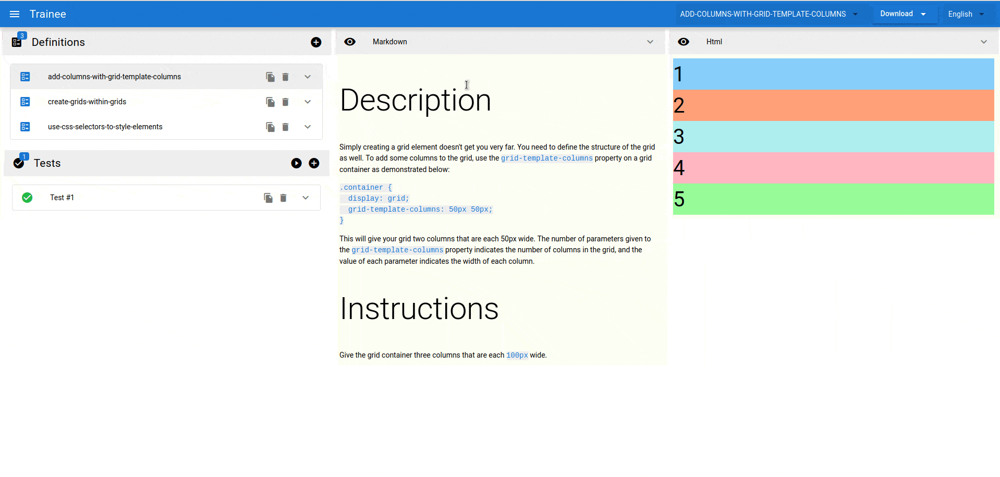

# Trainee

A very simple Quasar application to learn Vue.

This simple app may be usefull to trainers/teachers while they are in the process of creating new freeCodeCamp challenges by doing in-place editing of those challenge's parts.

Once the challenge editing is done, they can download the markdown definition and just copy & paste into the corresponding freeCodeCamp challenges language folder; or download & save the json definition into this project @ src/training-definitions folder to increment the Trainee library.

Once this entire process is done, a PR can be created on the freeCodeCamp fork so this new challenges can be merged for helping other people to learn the technology stack they require.

- Is based on json definition files
  - See schema/examples @ src/training-definitions folder or type @ src/types/Definition.ts
  - Definition contains:
    - Id
    - Name
    - Category
    - Description (which is markdown text)
    - Html Source 
    - Source Tests (which are the JQuery tests to apply to html source)
    - etc.
- You can create as much definitions as you want
- You can CRUD on them and also on its test sources plus being able to run the created tests

## Possible Improvements
- This application could consume some freeCodeCamp API so, the challenges are loaded from freeCodeCamp & saved directly into its sources to avoid any manual process of downloading & copying files.
- The application could implement some extra layouts so the end user can focus specifically on the markdown or html editing part.

## Disclaimer
- The implemented challenge definition in this project may not cover all of the possible options available in freeCodeCamp challenges.
- Although freeCodeCamp client is implemented in React, this client project has been written in Quasar/Vue (as stated above) just for the sake of learning Vue.

## Demo


## Install the dependencies
```bash
yarn
```

### Start the app in development mode (hot-code reloading, error reporting, etc.)
```bash
quasar dev
```

### Lint the files
```bash
yarn run lint
```

### Build the app for production
```bash
quasar build
```

### Customize the configuration
See [Configuring quasar.conf.js](https://quasar.dev/quasar-cli/quasar-conf-js).
